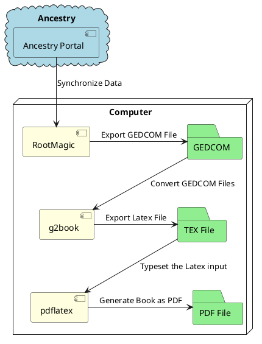

<!--


``` plantuml 

@startuml

cloud  "Ancestry"  #lightblue { 
  [Ancestry Portal] #lightblue 
} 

node "Computer" {
  [RootMagic] #lightyellow
  [g2book] #lightyellow
 folder "GEDCOM" #lightgreen {
 }
 folder "TEX File" #lightgreen {
 }
 [pdflatex] #lightyellow
 folder "PDF File" #lightgreen {
 }  
}

[Ancestry Portal] -down-> [RootMagic] : Synchronize Data
[RootMagic] -right-> [GEDCOM] : Export GEDCOM File
[GEDCOM] -down-> [g2book] : Convert GEDCOM Files 
[g2book] -right-> [TEX File] : Export Latex File
[TEX File] -down-> [pdflatex] : Typeset the Latex input
[pdflatex] -right-> [PDF File] : Generate Book as PDF
@enduml
```
-->



See  for more information.

<!-- ---
```
This file is located at: {{ page.path }}
```
--- -->