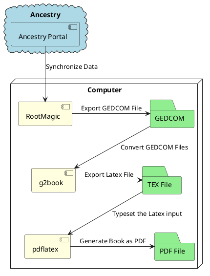

<!--


-->

## Overview

The tool provided by the maiorum series is one piece in a chain of tasks to generate the final *book*.

This description is my personal setup. Due to the usage of some standard file formats is should be possible to adjust the selection of the tools to the personal needs. I describe it here for a overall understanding.

### Cloud services

There are a couple of cloud services which offer the research of public documents and exchange of information in the community in a genealogy area. For most you need a subscription and you need to upload the data.

I did this with one provider which is *ancestry* which allows me to explore public documents.

Unfortunately for the cloud provider there is no direct way to reuse the collected information.

### Local genealogy program

I use a local genealogy program on my Windows machine to synchronize the cloud provider information with my local genealogy database. There are some programs from the wide offering of local genealogy programs which offer a synchronization with the cloud provider. I use the *Rootsmagic*.  This allows me to download the information i found in the exploration sessions in the internet, merge it with my local database and most importantly download a copy of the public documents.

These programs have typically a proprietary database format and access to this data is restricted.

But all of the genealogy program allow the export of a Standard file format which is called *GEDCOM*.

### GEDCOM File

The GEDCOM File is a file format which contains all the genealogy information in one file (except the images itself).

Although the GEDCOM file structure is described there are still custom extensions as well non unique way to store the data. This leads to some variations of interpretation of GEDCOM Files from different genealogy programs.

### gc2book from maiorum series

Now this is the application which is converting the genealogy information from the *GEDCOM* file into a format which describes the content of a book. The output is a *LaTeX* file which is the input for a public domain application which can typeset documents.

### Pdflatex

*LaTeX* is a public domain application which can typeset documents and pdflatex is one application which can typeset a *LaTeX* into a *PDF* file which is a platform neutral book format.

### Workflow Diagram

See here the overall workflow in a diagram



See  for more information.

<!-- ---
```
This file is located at: {{ page.path }}
```
--- -->